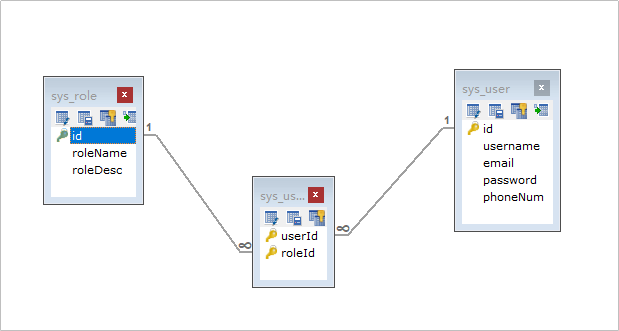
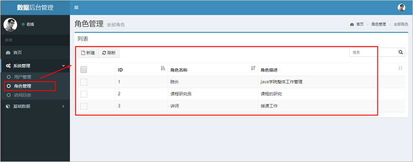
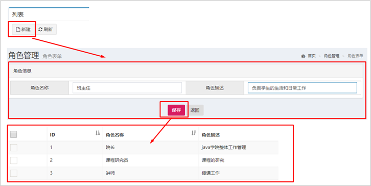
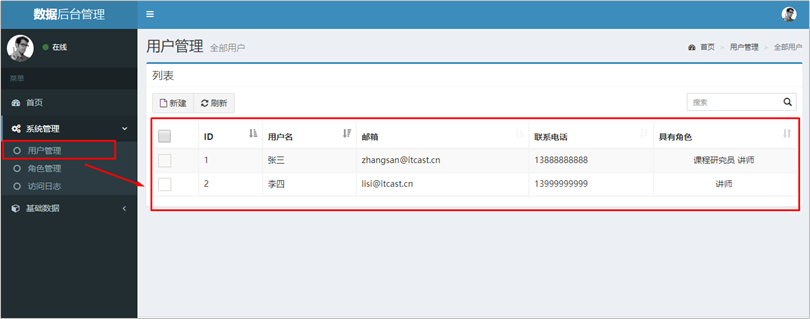
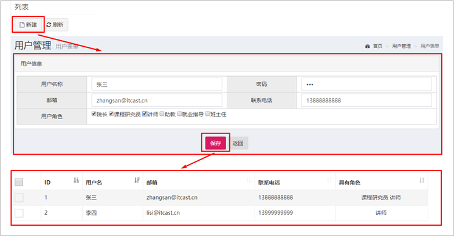
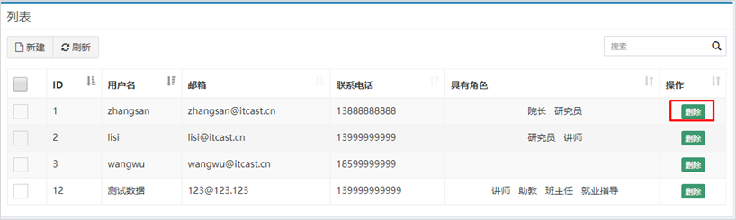
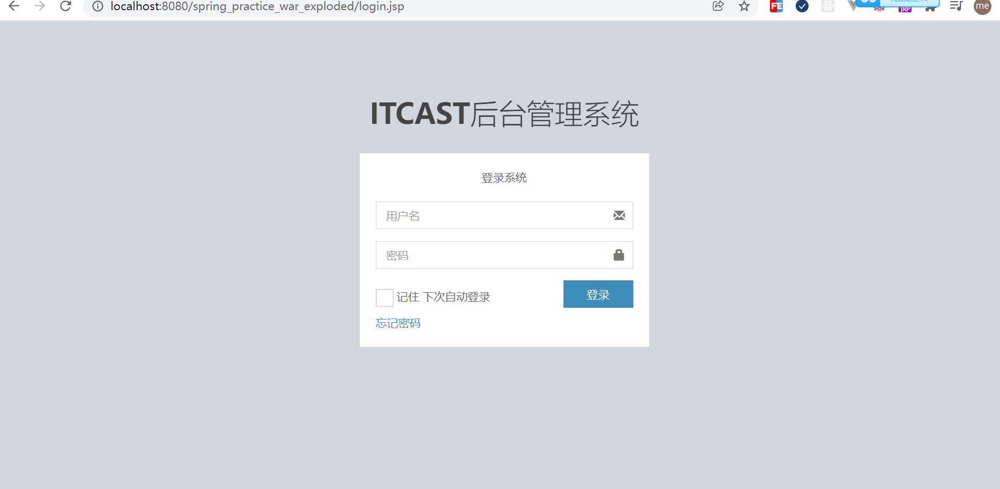

# Spring练习环境搭建

#### 1、Spring环境搭建步骤

1. 创建工程(Project&Module)
2. 导入静态页面
3. 导入需要的依赖（pom.xml）
4. 创建包结构（controller、service、dao、domain、utils）
5. 导入数据库脚本
6. 创建POJO类（User.java、role.java）
7. 创建配置文件(applicationContext.xml、spring-mvc.xml、db.properties、log4j.properties)

#### 2、用户和角色的关系



#### 4、**角色列表的展示效果**



#### 5、**角色列表的展示步骤分析**

①点击角色管理菜单发送请求到服务器端（修改角色管理菜单的url地址）

②创建RoleController和showList()方法

③创建RoleService和showList()方法

④创建RoleDao和findAll()方法

⑤使用JdbcTemplate完成查询操作

⑥将查询数据存储到Model中

⑦转发到role-list.jsp页面进行展示

#### 6、**角色添加的效果**



#### 7、**角色添加的步骤分析**

①点击列表页面新建按钮跳转到角色添加页面

②输入角色信息，点击保存按钮，表单数据提交服务器

③编写RoleController的save()方法

④编写RoleService的save()方法

⑤编写RoleDao的save()方法

⑥使用JdbcTemplate保存Role数据到sys_role

⑦跳转回角色列表页面

#### 8、**用户列表的展示效果**



#### 9、**用户列表的展示步骤分析**

①点击用户管理菜单发送请求到服务器端（修改用户管理菜单的url地址）

②创建UserController和showList()方法

③创建UserService和showList()方法

④创建UserDao和findAll()方法

⑤使用JdbcTemplate完成查询操作

⑥将查询数据存储到Model中

⑦转发到user-list.jsp页面进行展示

#### 10、**用户添加的效果**



#### 11、**用户添加的步骤分析**

①点击列表页面新建按钮跳转到角色添加页面

②输入角色信息，点击保存按钮，表单数据提交服务器

③编写RoleController的save()方法

④编写RoleService的save()方法

⑤编写RoleDao的save()方法

⑥使用JdbcTemplate保存Role数据到sys_role

⑦跳转回角色列表页面

#### 12、**删除用户的效果**



#### 13、**删除用户的步骤分析**

①点击用户列表的删除按钮，发送请求到服务器端

②编写UserController的deleteById()方法

③编写UserService的deleteById()方法

④编写UserDao的deleteById()方法

⑤编写UserDao的deleteRelByUid()方法

⑥跳回当前用户列表页面

#### 14、权限拦截器

①点击任意跳转按钮，需要先判断用户是否登录，未登录前往登录页

② 新建interceptor包，同时新建PrivilegeInterceptor并实现HandlerInterceptor接口

```java
public class PrivilegeInterceptor implements HandlerInterceptor {
    public boolean preHandle(HttpServletRequest request, HttpServletResponse response, Object handler) throws Exception {
        // 逻辑：判断用户是否登录，本质是判断session中是否存在当前的user
        HttpSession session = request.getSession();

        User user = (User) session.getAttribute("user");

        if (user == null) {
            // 没有登录, 重定向到登录页
            response.sendRedirect(request.getContextPath()+ "/login.jsp");
            return false;
        }

        // 放行、访问目标资源
        return true;
    }
}
```

③ 在spring-mvc.xml中配置拦截器

```xml
<!-- 配置权限拦截器 -->
<mvc:interceptors>
    <mvc:interceptor>
        <mvc:mapping path="/**/"/>
        <bean class="com.example.interceptor.PrivilegeInterceptor"/>
    </mvc:interceptor>
</mvc:interceptors>
```

重新发布项目，未登录情况下点击都会跳转到登录页



#### 15、登录功能实现

逻辑：将用户输入的用户名和密码和数据库中的用户名和密码进行比对，正确则将用户信息存入到session中，并且跳转到首页。用户名、密码不正确则不跳转。


## 总结

待完成